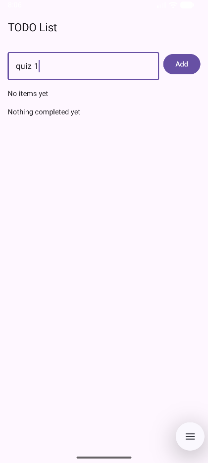
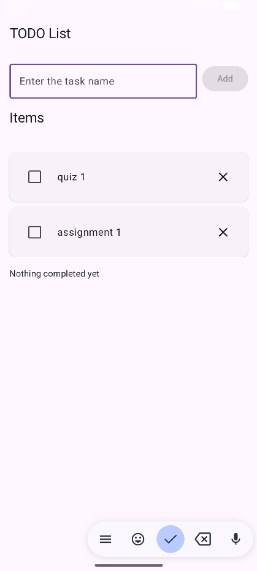
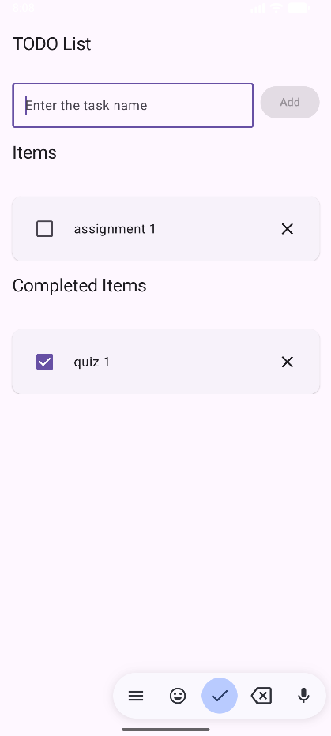
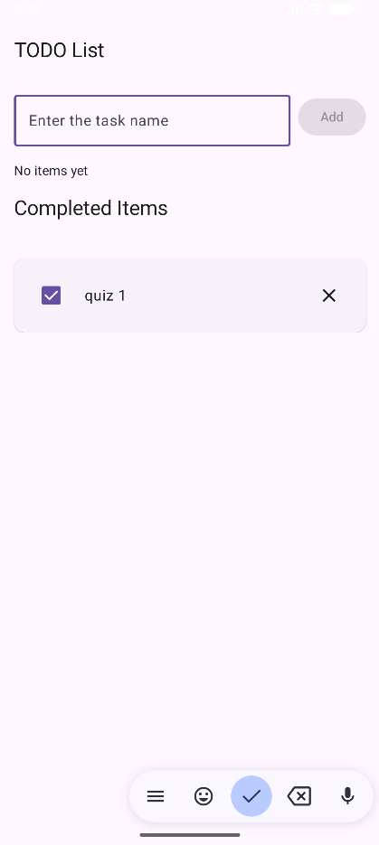

# 📝 Jetpack Compose To-Do App

A simple, polished To-Do app built with **Kotlin** and **Jetpack Compose**.  
It demonstrates **data classes**, **state**, **remember/rememberSaveable**, and **state hoisting** with a clean, unidirectional data flow.


## 📱 Overview

The app has two sections:

- **Items (Active)**
- **Completed Items**

You can:
- Add a new task (trims whitespace; blank input shows inline validation).
- Toggle a task’s checkbox to move it between Active and Completed.
- Delete a task from either section.
- See friendly empty-state messages when a section is empty.
- Keep state across simple configuration changes (e.g., rotation).


## 🧩 Architecture

```
MainActivity (entry point)
└── TodoApp() – stateful parent composable
    ├── Holds input text + error (rememberSaveable)
    ├── Observes state from TodoViewModel
    ├── Renders:
    │   ├── AddRow() – stateless input + Add button
    │   ├── Section("Items") – header + list/empty state
    │   └── Section("Completed Items") – header + list/empty state
    └── Passes event lambdas to children

TodoViewModel – holds mutableStateListOf<TodoItem>, exposes add/toggle/delete
TodoItem – Kotlin data class (id, label, isDone)
```

**Unidirectional data flow:**  
UI events → ViewModel functions → state changes → UI recomposes


## 🛠️ Implementation Details

### Data Model
```kotlin
data class TodoItem(
    val id: String = java.util.UUID.randomUUID().toString(),
    val label: String,
    val isDone: Boolean = false
)
```

### State & Persistence
- The list of items lives in **`TodoViewModel`** using `mutableStateListOf` so Compose observes changes.
- Text input + inline error use **`rememberSaveable`** so they survive rotation.

### State Hoisting
- `AddRow`, `Section`, and `TodoRow` are **stateless**: they receive data and callbacks from the parent (`TodoApp`).

### Accessibility & UX
- Clear labels, large touch targets, friendly empty-state messages.
- Titles **“Items”** and **“Completed Items”** are always visible.


## 📂 Project Structure (key files)

```
app/
 └─ src/main/java/com/uanish/todoapp/
     ├─ MainActivity.kt         # Composables: TodoApp, AddRow, Section, TodoRow
     ├─ TodoViewModel.kt        # ViewModel: items + add/toggle/delete
     └─ TodoItem.kt             # Data class
 └─ src/main/res/               # Themes, colors, etc.
README.md
```

## 🖼️ Screenshots

| Empty                           | Active                            | Completing a task                               | Deleted other task                            |
|---------------------------------|-----------------------------------|-------------------------------------------------|-----------------------------------------------|
|  |  |  |  |

## 👤 Author

**Name:** _Anish Ummenthala_  
**Course:** _CPSC 411 – Android Development_  
**Semester:** _Fall 2025_  
